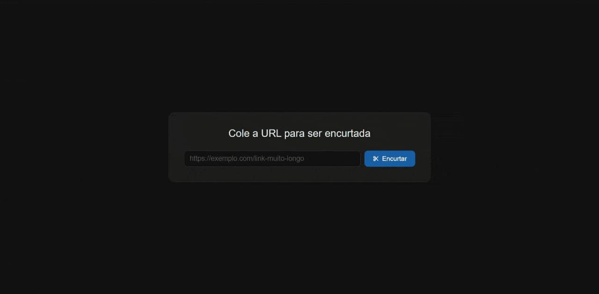

# 🔗 Encurta URL API

> API REST para encurtamento de links — construída com Laravel 13 e MySQL.



## 📋 Sobre o projeto

O **Encurta URL API** é uma API de encurtamento de links. O usuário envia uma URL longa e recebe um código curto único. Ao acessar o link curto, é redirecionado automaticamente para a URL original — e cada acesso é contabilizado.

O projeto foi desenvolvido como portfólio para demonstrar conhecimentos em arquitetura de APIs REST, lógica de geração de códigos únicos e boas práticas de desenvolvimento back-end com Laravel.

## ✨ Funcionalidades

| Ação | Descrição |
|---|---|
| **Encurtar URL** | Gera um código curto único para uma URL longa |
| **Redirecionar** | Acessa o link curto e redireciona para a URL original |
| **Contar acessos** | Incrementa o contador a cada redirecionamento |
| **Listar links** | Retorna todos os links encurtados com métricas |
| **Apagar link** | Remove um link encurtado |

## 🛠️ Tecnologias utilizadas

- **PHP 8.5** + **Laravel 13**
- **MySQL** — banco de dados relacional
- **Eloquent ORM** — mapeamento objeto-relacional
- **Form Request** — validação da URL enviada
- **Blade** — interface simples para teste visual
- **Postman** — testes de endpoints durante desenvolvimento

## 🏗️ Arquitetura

```
app/
├── Http/
│   ├── Controllers/
│   │   └── LinkController.php       # Gerencia todas as ações de links
│   └── Requests/
│       └── StoreLinkRequest.php     # Validação da URL de entrada
└── Models/
    └── Link.php                     # Model com campos permitidos

database/
└── migrations/
    └── create_links_table.php       # Estrutura da tabela

resources/
└── views/
    └── index.blade.php              # Interface para teste visual

routes/
├── api.php                          # Rotas JSON (criar, listar, apagar)
└── web.php                          # Rota de redirecionamento HTTP
```

**Fluxo de uma requisição:**

```
POST /api/links → Validação → Gera short_code único → Salva no banco → Retorna JSON

GET /{code} → Busca no banco → Incrementa visits → Redireciona para original_url
```

## 🧠 Decisões técnicas

### Por que separar rotas em api.php e web.php?
As rotas da API retornam JSON e ficam em `api.php`. A rota de redirecionamento não retorna JSON — ela retorna um redirecionamento HTTP — então fica em `web.php`. Cada arquivo tem uma responsabilidade clara.

### Por que usar do...while para gerar o short_code?
O código curto é gerado com `Str::random(5)` dentro de um loop `do...while` que verifica se o código já existe no banco antes de salvar. Isso garante unicidade sem depender apenas de uma constraint — em sistemas com muitos links, colisões são possíveis e precisam ser tratadas.

### Por que firstOrFail no redirecionamento?
Se o código curto não existir no banco, o Laravel retorna automaticamente um erro `404` sem precisar de tratamento manual. Menos código, comportamento correto.

### Por que Route Model Binding no destroy?
Em vez de buscar manualmente `Link::find($id)`, o Laravel injeta o modelo diretamente pelo `{link}` na rota. Se não existir, retorna 404 sozinho.

## 🚀 Como rodar localmente

### Pré-requisitos

- PHP 8.2+
- Composer
- MySQL

### Instalação

```bash
# 1. Clone o repositório
git clone https://github.com/felipekauan1/encurta-url-api.git
cd encurta-url-api

# 2. Instale as dependências
composer install

# 3. Configure o ambiente
cp .env.example .env
php artisan key:generate

# 4. Configure o banco de dados no .env
DB_DATABASE=encurta_url_api
DB_USERNAME=root
DB_PASSWORD=sua_senha

# 5. Crie o banco e rode as migrations
php artisan migrate
```

### Rodando o projeto

```bash
php artisan serve
```

Acesse `http://localhost:8000` no navegador.

## 📡 Endpoints da API

### Encurtar URL
```
POST /api/links
Content-Type: application/json

{
    "original_url": "https://exemplo.com/link-muito-longo"
}
```

**Resposta (201):**
```json
{
    "message": "Link criado com sucesso!",
    "link": {
        "id": 1,
        "original_url": "https://exemplo.com/link-muito-longo",
        "short_code": "abc12",
        "visits": 0,
        "created_at": "2026-05-20T...",
        "updated_at": "2026-05-20T..."
    }
}
```

### Listar todos os links
```
GET /api/links
```

**Resposta (200):**
```json
{
    "links": [
        {
            "id": 1,
            "original_url": "https://exemplo.com/link-muito-longo",
            "short_code": "abc12",
            "visits": 42,
            "created_at": "2026-05-20T...",
            "updated_at": "2026-05-20T..."
        }
    ]
}
```

### Redirecionar
```
GET /{code}
```

Redireciona para a URL original e incrementa o contador de acessos. Retorna `404` se o código não existir.

### Apagar link
```
DELETE /api/links/{id}
```

**Resposta (200):**
```json
{
    "message": "Link deletado com sucesso!"
}
```

## 📌 Possíveis melhorias futuras

- Data de expiração para links
- QR Code gerado automaticamente para cada link
- Testes automatizados com PHPUnit

## 👨‍💻 Autor

Desenvolvido por **[@felipekauan1](https://github.com/felipekauan1)**

## 📄 Licença

Este projeto está sob a licença MIT.
